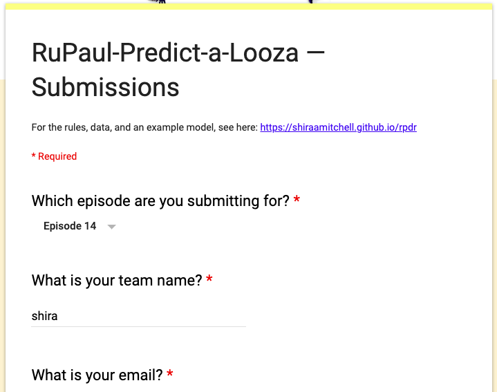
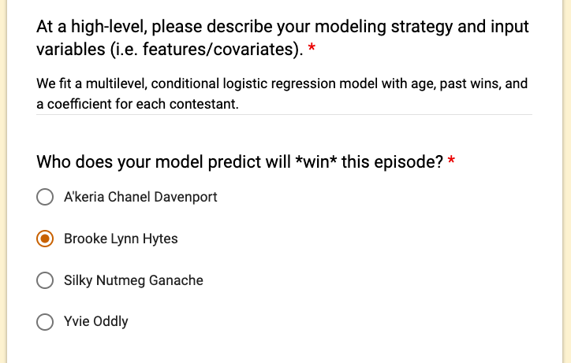
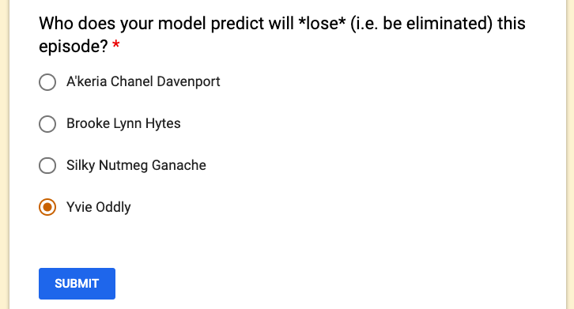

# Overview

Welcome to the RuPaul-Predict-a-Looza (and winner)!

## Goal
Build a predictive model that accurately predicts the **winner and loser** of each RuPaul's Drag Race episode before that new episode airs.


## Winners
Teams with the highest proportion of correct predictions over the season (i.e. lowest average [0-1 loss](https://en.wikipedia.org/wiki/Loss_function#0-1_loss_function)). The prize: bragging rights and the ability to add one policy question on the next [Data for Progress](https://twitter.com/DataProgress) survey.

## Rules

Models can use any **publicly-available information**: e.g. blog posts, Twitter sentiment, Instagram followers. To get you started, we at [Data for Progress](https://twitter.com/DataProgress) provide datasets [here](https://docs.google.com/spreadsheets/d/1Sotvl3o7J_ckKUg5sRiZTqNQn3hPqhepBSeOpMTK15Q/edit?usp=sharing):

1. all_episodes: episode-level data, past 10 seasons
2. all_contestants: contestant-level data, past 10 seasons, current season (season 11)
3. all_rankings: episode-contestant-level data, past 10 seasons
4. all_social_media: contestant-time-level data, seasons 4 through 10 (with some gaps), current season (season 11)
5. survey_votes: vote-level data from the [survey](https://www.allourideas.org/rpdr-s11-w5) (you can participate!), current season (season 11)
6. survey_contestants: contestant-level data from the [survey](https://www.allourideas.org/rpdr-s11-w5), current season (season 11)

We will be updating datasets throughout the current season (season 11).

Models cannot use non-public information. They can, however, create their own datasets based on publicly-available information.

Each week (**starting February 28**), each team must **submit their predictions** by 5:00 PM EST each day an episode airs (including the premiere on February 28). Each team must submit only one prediction (the winner and the loser) for each episode. If the episode has more than one winner (or more than one loser), a team is considered correct if they predict one of the winners (or losers). If the episode has no winner (or no loser), a team is considered correct regardless of their prediction. If a team does not submit for an episode, it counts as an incorrect prediction. If a team submits more than once for an episode, only the most recent (before the deadline) will count. We also require you to describe (at a high level) your modeling strategy and input variables (i.e. features/covariates).

Predictions should be submitted [here](https://goo.gl/forms/CDLwadteV5psAUy73).

At the end of the competition, we ask that you also **share your code and data** for educational purposes. The goal of the competition is to encourage engagement with data science.

Sidenote: We will also compare teams' loser predictions to [Corey Johnson](https://twitter.com/CoreyinNYC)'s (speaker of the New York City Council). Corey will submit a weekly guess as to which queen will be eliminated in the episode.

Questions? Email rupaulpredictalooza@gmail.com

# Getting started

Following advice from [Bayesian Data Analysis](http://www.stat.columbia.edu/~gelman/bayescomputation/bdachapter6.pdf), we "start with a simple model that uses only some of the available information". Teams can start here, or somewhere else entirely! This is only one example approach. You can use a different modeling approach and/or add variables. Code for this notebook is [here](https://github.com/shiraamitchell/rpdr).

We *wrangle* data (get data into R in a useful form) in the [tidyverse](https://www.tidyverse.org/), a collection of R packages that share a common philosophy. We conduct *analysis* in [Stan](http://mc-stan.org/), open-source software to do fully Bayesian inference.

```{r setup, message = FALSE, warning = FALSE}
library(tidyverse)
library(knitr)
library(googlesheets)
library(rstan)
knitr::dep_prev()
```

## Wrangle

We begin by data wrangling, getting data into R in a useful form. We import and join datasets. We standardize continuous variables (see [this paper](http://www.stat.columbia.edu/~gelman/research/published/standardizing7.pdf)).

```{r wrangled, message = FALSE, warning = FALSE, cache = TRUE}
gs_auth()
rpdr_data <- "1Sotvl3o7J_ckKUg5sRiZTqNQn3hPqhepBSeOpMTK15Q" %>%  gs_key

all_episodes <- rpdr_data %>% gs_read("all_episodes")
all_contestants <- rpdr_data %>% gs_read("all_contestants")
all_rankings <- rpdr_data %>% gs_read("all_rankings")

#--------------------- add next episode to predict ---------------------#
all_episodes_next <- add_row(all_episodes, season_number = 11, episode_number = 4,
                             episode_airdate = NA, episode_title = NA,
                             episode_type = "Competition", episode_maxi_challenge_type = NA) %>% 
  arrange(season_number, episode_number) %>% rowid_to_column("t")
season_11_contestants <- (all_contestants %>% filter(season_number == 11))$contestant_id
eliminated_contestants <- (all_rankings %>% filter(is.element(episode_placement,c('ELIM','Eliminated'))))$contestant_id
next_contestants <- setdiff(season_11_contestants, eliminated_contestants)
all_rankings_next <- add_row(all_rankings, season_number = 11, episode_number = 4, 
                             contestant_id = next_contestants, episode_placement = NA)
#-----------------------------------------------------------------------#

wrangled <- all_rankings_next %>%
  left_join(all_contestants, by = c("season_number","contestant_id")) %>%
  left_join(all_episodes_next, by=c("season_number", "episode_number")) %>%
  mutate(placement = case_when(is.element(episode_placement,c('WIN','Winner')) ~ 1,
                      is.element(episode_placement,c('ELIM','Eliminated'))  ~ -1,
                      TRUE ~ 0)) %>%
  group_by(t) %>% mutate(num_winners = sum(placement == 1), 
                         num_losers = sum(placement == -1)) %>% 
  arrange(desc(placement), .by_group = TRUE) %>% ungroup() %>% # within episode: winner first, loser last
  filter(is.element(episode_type,c('Competition','Finale'))) %>%
  group_by(contestant_id) %>% mutate(past_wins = cumsum(placement == 1) - (placement == 1)) %>%
  ungroup() %>%
  mutate(z.past_wins = (past_wins - mean(past_wins))/(2*sd(past_wins))) %>%
  mutate(z.age = (age - mean(age))/(2*sd(age))) %>%
  filter((num_winners == 1 & num_losers == 1) | t == max(t)) %>% # use data on typical episodes
  filter(!is.element(episode_placement,c('Guest','Miss C')) | t == max(t)) %>% # use data on typical contestants
  select(season_number, episode_number, t, contestant_id, contestant_name, # identifiers
         z.age, z.past_wins, # x variables
         placement, num_winners, num_losers) # episode outcomes

# renumber episodes skipping the atypical ones:
wrangled$t <- as.numeric(as.factor(wrangled$t))
next_t = max(wrangled$t)
```

Our wrangled data look like this:
```{r view1_wrangled, message = FALSE, warning = FALSE, echo = FALSE, cache = TRUE}
kable(wrangled %>% filter(t == min(t)), digits = 2)
```
...
...
...
```{r view2_wrangled, message = FALSE, warning = FALSE, echo = FALSE, cache = TRUE}
kable(wrangled %>% filter(t == max(t)), digits = 2)
```

## Model

Now that we wrangled our data, we can model. Let $i$ index the contestants and $t$ index the episodes. We fit a [multilevel](http://www.stat.columbia.edu/~gelman/arm/), [conditional logistic](https://en.wikipedia.org/wiki/Conditional_logistic_regression) regression model with age, past wins, and a coefficient for each contestant. Here is our model in mathematical notation: 

$$\eta_{it} = \beta_\text{age} \text{age}_i + \beta_\text{past_wins} \text{past_wins}_{it} + \alpha_i \ \ \text{ for } i \text{ playing in episode } t$$

$$P[i^* \text{ wins episode }t] = \frac{\exp(\eta_{i^*t})}{\sum_i \exp(\eta_{it})}$$

$$P[i_* \text{ loses episode }t] = \frac{\exp(-\eta_{i_*t})}{\sum_{i \ne i^*} \exp(-\eta_{it})}$$
$$\alpha_i \sim N(0, \sigma)$$

We have [prior knowledge from large corpuses of logistic regressions](http://www.stat.columbia.edu/~gelman/research/published/priors11.pdf) to rule out unreasonable values for coefficients. We express this by putting a Student's t prior on $\beta_\text{age}$ and $\beta_\text{past_wins}$. This is a reasonable default prior when coefficients should be close to zero but have some chance of being large. We put a half-Normal prior on $\sigma$. We follow the recommendations [here](https://github.com/stan-dev/stan/wiki/Prior-Choice-Recommendations).

```{stan, output.var='model', cache = TRUE}
data {
  int N; // number of contestant-episode observations
  int I; // number of contestants
  int T; // number of episodes
  int<lower=1,upper=I> ii[N]; // contestant for each observation
  int num_contestants[T]; // number of contestants for each episode
  vector[N] age;
  vector[N] past_wins;
}
parameters {
  real beta_age;
  real beta_past_wins;
  vector[I] alpha_contestant_raw;
  real<lower=0> sigma;
}
transformed parameters {
  vector[I] alpha_contestant = alpha_contestant_raw * sigma;
}
model {
  vector[N] eta = beta_age * age + beta_past_wins * past_wins + alpha_contestant[ii];
  beta_age ~ student_t(6,0,2.5);
  beta_past_wins ~ student_t(6,0,2.5);
  alpha_contestant_raw ~ normal(0,1);
  sigma ~ normal(0,1);
  { int pos;
  pos = 1;
  for (t in 1:T) {
    vector[num_contestants[t]] eta_t = segment(eta, pos, num_contestants[t]);
    target += eta_t[1] - log_sum_exp(eta_t);
    target += -1*eta_t[rows(eta_t)] - log_sum_exp(-1*eta_t[2:rows(eta_t)]); // remove winner (listed first)
    pos = pos + num_contestants[t];
  }}
}
```


```{r fit, results = "hide", message = FALSE, cache = TRUE}
fit_model <- function(df) {
  standata <- list(
    N = nrow(df),
    I = max(df$contestant_id),
    T = max(df$t),
    ii = df$contestant_id,
    num_contestants = (df %>% group_by(t) %>% summarise(n = n()))$n,
    age = df$z.age,
    past_wins = df$z.past_wins
  )
  sampling(object = model, data = standata, chains = 4, iter = 2000, control = list(adapt_delta = 0.99))
}
data_so_far <- wrangled %>% filter(t < next_t)
fit <- fit_model(df = data_so_far)
```


```{r stan_plot}
print(fit, pars = c('beta_age','beta_past_wins','sigma'))
stan_plot(fit, pars = c('beta_age','beta_past_wins','sigma')) + geom_vline(xintercept=0, size = 2)
```


To estimate the predictive performance for new episodes we use *leave-future-out cross-validation*:

```{r lfo-cv, results = "hide", message = FALSE, warning=FALSE, cache = TRUE}
Mode <- function(x) {
  ux <- unique(x)
  ux[which.max(tabulate(match(x, ux)))]
}
L = 30 # always use at least L past episodes of data
correct = c()
random_correct = c()
# this will take a long time!
for (t_current in (L+1):(next_t - 1)) {
  data_current <- wrangled %>% filter(t < t_current) # leave-future-out
  fit_current <- fit_model(df = data_current)
  newdata <- wrangled %>% filter(t == t_current)
  s <- as.data.frame(fit_current) # simulations from the posterior
  eta_s <- matrix(NA, nrow = nrow(s), ncol = nrow(newdata))
  for (n in 1:nrow(newdata)) {
    i = newdata$contestant_id[n]
    if (is.element(i,data_current$contestant_id)) { # we have seen this contestant before
      alpha_contestant_s <- s[,c(paste('alpha_contestant[',i,']',sep=''))]
    } else { # this is a new contestant
      alpha_contestant_s <- rnorm(n = nrow(s), mean = 0, sd = s$sigma)
    }
    eta_s[,n] <- s$beta_age * newdata$z.age[n] + s$beta_past_wins * newdata$z.past_wins[n] + alpha_contestant_s
  }
  winner_s <- apply(eta_s, MARGIN = 1, FUN = which.max)
  pred_winner <- Mode(winner_s)
  loser_s <- apply(eta_s, MARGIN = 1, FUN = which.min)
  pred_loser <- Mode(loser_s)
  correct <- c(correct, (newdata$placement[pred_winner] == 1) & 
                 (newdata$placement[pred_loser] == -1))
  random_correct = c(random_correct, (1/nrow(newdata))*(1/(nrow(newdata)-1)))
}
```

We get `r round(mean(correct)*100)`% accuracy with our model. A random guess gets `r round(mean(random_correct)*100)`% accuracy. Can your model do better?

Sidenote: Computing leave-future-out cross-validation above took a long time. For an approximate leave-future-out cross-validation that is much faster, see [this paper](https://github.com/paul-buerkner/LFO-CV-paper/blob/master/LFO-CV.pdf).

## Predict and submit

Let's now use our model to predict the winner and loser of the next episode:

```{r predict, results = "hide", message = FALSE, warning=FALSE, cache = TRUE}
newdata <- wrangled %>% filter(t == next_t)
s <- as.data.frame(fit) # simulations from the posterior
eta_s <- matrix(NA, nrow = nrow(s), ncol = nrow(newdata))
for (n in 1:nrow(newdata)) {
  i = newdata$contestant_id[n]
  if (is.element(i,data_so_far$contestant_id)) { # we have seen this contestant before
    alpha_contestant_s <- s[,c(paste('alpha_contestant[',i,']',sep=''))]
  } else { # this is a new contestant
    alpha_contestant_s <- rnorm(n = nrow(s), mean = 0, sd = s$sigma)
  }
  eta_s[,n] <- s$beta_age * newdata$z.age[n] + s$beta_past_wins * newdata$z.past_wins[n] + alpha_contestant_s
}
winner_s <- apply(eta_s, MARGIN = 1, FUN = which.max)
pred_winner <- Mode(winner_s)
loser_s <- apply(eta_s, MARGIN = 1, FUN = which.min)
pred_loser <- Mode(loser_s)
```

We predict `r newdata$contestant_name[pred_winner]` will win and `r newdata$contestant_name[pred_loser]` will lose.

To submit, we go [here](https://goo.gl/forms/CDLwadteV5psAUy73):






